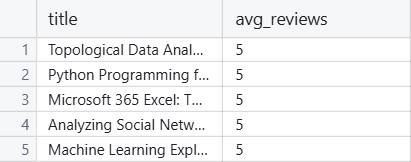
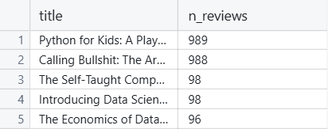

# SQL Analysis of Book Success Factors

## Overview

This project demonstrates SQL queries used to explore factors contributing to the success of books related to data science, statistics, Python, and machine learning. Using a dataset of 900+ books, I investiage the relationship between books attributes such as __rating__, __number of reviews__, and __price__ to answer key questions about what makes a book successful.

The SQL queries used in this project showcase my ability to:
- Perform basic data retrieval with `SELECT`, `FROM`, and `WHERE`
- Sort and filter data using `ORDER BY` and logical operators
- Use aggregate function like `COUNT()`, `AVG()`, and `SUM()`
- Group data with `GROUP BY` and filter aggregated results with `HAVING`

## SQL Queries & Analysis

1. __Which books have the highest rating?__

    This query identifies the books with the highest average user rating.

    ```sql
    SELECT title, avg_reviews
    FROM dsbooks
    ORDER BY avg_reviews DESC
    LIMIT 5;
    ```

    

2. __Which books have the most reviews?__

    This query helps identify the books that have the highest number of reviews, indicating popularity.

    ```sql
    SELECT title, n_reviews
    FROM dsbooks
    WHERE n_reviews IS NOT NULL
    ORDER BY n_reviews DESC
    LIMIT 5;
    ```

    