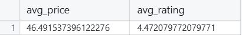
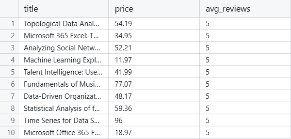
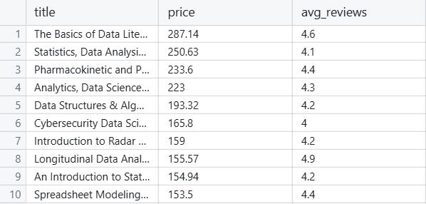
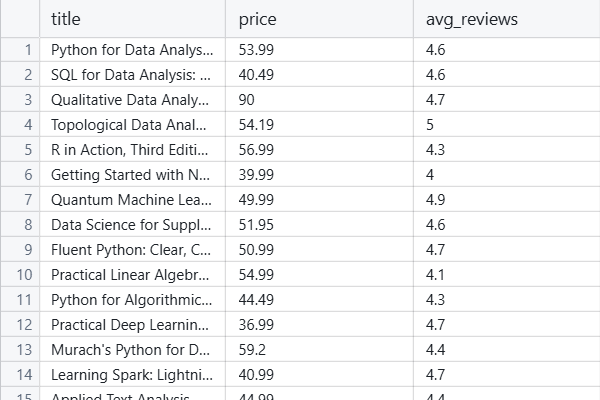
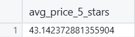
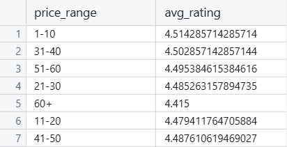
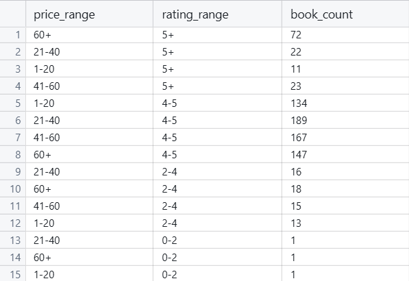
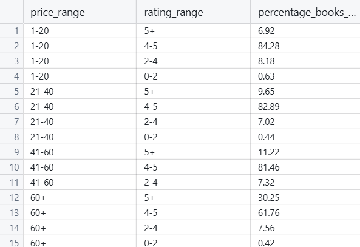
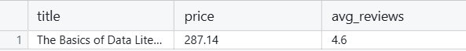
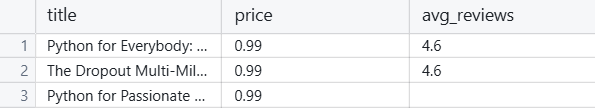

# SQL Project: Does Price Correlate with Quality?

## Project Overview

This SQL project aims to explore the relationship between book prices and their quality, as measured by average user ratings. The project uses a dataset of books to analyze various correlations and patterns, providing valuable insights on the connection between quality and price of a book. The primary question addressed is:

- **Does the price of a book correlate with its quality?**

By analyzing this relationship, the project seeks to provide insights that could benefit the book industry, authors, publishers, and consumers who may wish to understand how price and quality interact in the book market.

## Table of Contents

1. [Project Overview](#project-overview)
2. [Data Schema](#data-schema)
3. [SQL Techniques Used](#sql-techniques-used)
4. [Key Queries and Insights](#key-queries-and-insights)
5. [Conclusion](#conclusion)

## Data Schema

The [dataset](https://www.kaggle.com/datasets/die9origephit/amazon-data-science-books/data) used in this project includes the following attributes:

- **title**: the title of the book.
- **author**: the author of the book.
- **price**: the price of the book.
- **pages**: the number of pages in the book.
- **avg_reviews**: the average review score of the book.
- **n_reviews**: the number of reviews the book has received.
- **star5, star4, star3, star2, star1**: the percentage of 5-star, 4-star, 3-star, 2-star, and 1-star reviews, respectively.
- **language**: the language in which the book is written.
- **publisher**: the publisher of the book.

## SQL Techniques Used

This project utilizes various SQL techniques to analyze the dataset:

- **Aggregation Functions**: `AVG()`, `COUNT()`, `ROUND()`
- **Conditional Grouping**: `CASE WHEN`
- **Window Functions**: `COUNT(*) OVER()`
- **Subqueries**: for filtering based on maximum or minimum values.
- **Joins and Groupings**: for organizing and categorizing data.
<br><br>
## Key Queries and Insights

### 1. Average Book Price & Review

**Query**: This query calculates the average price and average rating of books in the dataset.

```sql
SELECT AVG(price) AS avg_price, AVG(avg_reviews) AS avg_rating
FROM dsbooks;
```



**Insight**: This provides a baseline for further analysis.

***

### 2. Highest Rated Books vs. Highest Priced Books

**Query**: This pair of queries identifies the books with the highest ratings and the highest prices.

```sql
SELECT title, price, avg_reviews
FROM dsbooks
WHERE avg_reviews IS NOT NULL 
AND price IS NOT NULL
ORDER BY avg_reviews DESC
LIMIT 10;
```

```sql
SELECT title, price, avg_reviews
FROM dsbooks
WHERE avg_reviews IS NOT NULL 
AND price IS NOT NULL
ORDER BY price DESC
LIMIT 10;
```



**Significance**: Looking at these, we can see that while the rating ranges in books of all price ranges, higher priced books tend to have a rating of above 4.0 suggesting that higher prices indicate quality.

***

### 3. Books with Price > 35 and High Reviews (avg_reviews > 4)

**Query**: This query selects books that have a price greater than $35 and an average review score of 4 or higher.

```sql
SELECT title, price, avg_reviews 
FROM dsbooks
WHERE price > 35 AND avg_reviews >= 4;
```



**Significance**: Building off the last query and considering the average book costs $30-40, this shows that books that cost higher than average all tend to have a higher rated score.

***

### 4. Average Price of Books with a Rating of 5 Stars

**Query**: This query calculates the average price of books with at least one 5-star review.

```sql
SELECT AVG(price) AS avg_price_5_stars 
FROM dsbooks
WHERE star5 > 0;
```



**Insight**: By focusing on books with 5-star reviews, we see that the average price of all books with a 5 star rating ranges is 43. This is lower taking the average of the dataset regardless of rating indicating that multiple low priced books are rated 5 stars/

***

### 5. Average Rating by Price Range

**Query**: This query groups books by price range and calculates the average rating for each price group.

```sql
SELECT
    CASE
        WHEN price BETWEEN 0 AND 10 THEN '1-10'
        WHEN price BETWEEN 11 AND 20 THEN '11-20'
        WHEN price BETWEEN 21 AND 30 THEN '21-30'
        WHEN price BETWEEN 31 AND 40 THEN '31-40'
        WHEN price BETWEEN 41 AND 50 THEN '41-50'
        WHEN price BETWEEN 51 AND 60 THEN '51-60'
        ELSE '60+'
    END AS price_range,
    AVG(avg_reviews) AS avg_rating
FROM dsbooks
GROUP BY price_range
HAVING AVG(avg_reviews) > 3;
```



**Significance**: Using this query, we can see that dispite there being multiple different groups for comparing prices, the average rating of each group remains around the save average rating. This shows that the quality doesn't seem to be affected by the price.

***

### 6. Count of Books in Each Price and Rating Group

**Query**: This query groups books by price and rating ranges, providing the count of books in each group.

```sql
SELECT
    CASE
        WHEN price BETWEEN 0 AND 20 THEN '1-20'
        WHEN price BETWEEN 21 AND 40 THEN '21-40'
        WHEN price BETWEEN 41 AND 60 THEN '41-60'
        ELSE '60+'
    END AS price_range,
    
    CASE
        WHEN avg_reviews BETWEEN 0 AND 2 THEN '0-2'
        WHEN avg_reviews BETWEEN 2 AND 4 THEN '2-4'
        WHEN avg_reviews BETWEEN 4 AND 5 THEN '4-5'
        ELSE '5+' 
    END AS rating_range,

    COUNT(*) AS book_count
FROM dsbooks
GROUP BY price_range, rating_range
ORDER BY rating_range DESC;
```



**Significance**: By categorizing the books into different prices and rating ranges, we can see that most of the 5 star books are in the $60 or above range and the rest of the books range from 4-5 star ratings.

***

### 7. Percent of Books in Each Rating Group by Price

**Query**: This query calculates the percentage of books in each rating range within each price range.

```sql
SELECT
    price_range,
    rating_range,
    ROUND((COUNT(*) * 100.0 / total_books_per_price_range), 2) AS percentage_books_in_rating
FROM (
    SELECT 
        CASE
            WHEN price BETWEEN 0 AND 20 THEN '1-20'
            WHEN price BETWEEN 21 AND 40 THEN '21-40'
            WHEN price BETWEEN 41 AND 60 THEN '41-60'
            ELSE '60+'
        END AS price_range,
        
        CASE
            WHEN avg_reviews BETWEEN 0 AND 2 THEN '0-2'
            WHEN avg_reviews BETWEEN 2 AND 4 THEN '2-4'
            WHEN avg_reviews BETWEEN 4 AND 5 THEN '4-5'
            ELSE '5+' 
        END AS rating_range,

        price,
        avg_reviews,

        COUNT(*) OVER (PARTITION BY
            CASE
                WHEN price BETWEEN 0 AND 20 THEN '1-20'
                WHEN price BETWEEN 21 AND 40 THEN '21-40'
                WHEN price BETWEEN 41 AND 60 THEN '41-60'
                ELSE '60+'
            END) AS total_books_per_price_range

    FROM dsbooks
) AS grouped_books
GROUP BY price_range, rating_range, total_books_per_price_range
ORDER BY price_range, rating_range DESC;
```



**Significance**: By categorizing the books and distributing them with percentages, we can see a positive trend of books having a higher rating the more they cost.

***

### 8. Maximum and Minimum Priced Books with Ratings

**Query**: This query identifies the books with the maximum and minimum prices and their ratings.

```sql
SELECT title, price, avg_reviews
FROM dsbooks
WHERE price = (SELECT MAX(price) FROM dsbooks WHERE avg_reviews IS NOT NULL);
```

```sql
SELECT title, price, avg_reviews
FROM dsbooks
WHERE price = (SELECT MIN(price) FROM dsbooks WHERE avg_reviews IS NOT NULL);
```




**Significance**: By looking at the extremes, we can see that whether you price the book highly or not, most books get around the same rating of between 4-5 stars regardless of the price.

***

## Conclusion

Based on the analysis conducted in this project, several insights were uncovered regarding the relationship between book price and quality:

- **Price vs. Quality Correlation**: While higher-priced books tend to have slightly higher ratings, the relationship is not absolute. This can be seen in some book that are priced highly but have the same rating as books that have a price below $10

- **Consistent Ratings Across Price Ranges**: Looking at the distribution of ratings across various price groups, we can see that while some highly priced books have a bigger percentage of books that reach a 5 star rating, all categories tend to generalize towards the same rating areas. 

In conclusion, while price may influence a books quality to some extend, it is not a great predictor. Other factors should be at the head of what makes a book have a higher rating and more success. 
